# KKMProxy — как пользоваться

Приложение делает три разные вещи, и включать их можно по отдельности.

| Раздел | Что делает | Когда включать |
|---|---|---|
| **VPN** | Весь трафик телефона идёт через ваш сервер | Нужен полный доступ и подмена страны |
| **TgWs** | Работает только Telegram, остальное не трогает | Telegram не грузит сообщения и картинки |
| **byebyeDPI** | Обманывает фильтр провайдера без всякого сервера | Сайты открываются частично, видео тормозит |

Одновременно работает либо VPN, либо byebyeDPI в режиме VPN — Android разрешает
только одно VPN-подключение. TgWs совместим с обоими.

---

## Установка

В [релизах](https://github.com/kukmber/KKMProxy/releases/latest) лежит пять файлов.

| Файл | Кому |
|---|---|
| **arm64-v8a** | почти все телефоны с 2016 года — берите этот |
| armeabi-v7a | старые и очень дешёвые модели |
| universal | если сомневаетесь или предыдущие не встали |
| x86, x86_64 | эмуляторы и планшеты на Intel |

Android спросит разрешение устанавливать приложения из браузера — это нормально.
Play Protect может предупредить, что разработчик неизвестен: это значит лишь,
что подпись не зарегистрирована в Google, а не что внутри что-то плохое.

---

## VPN

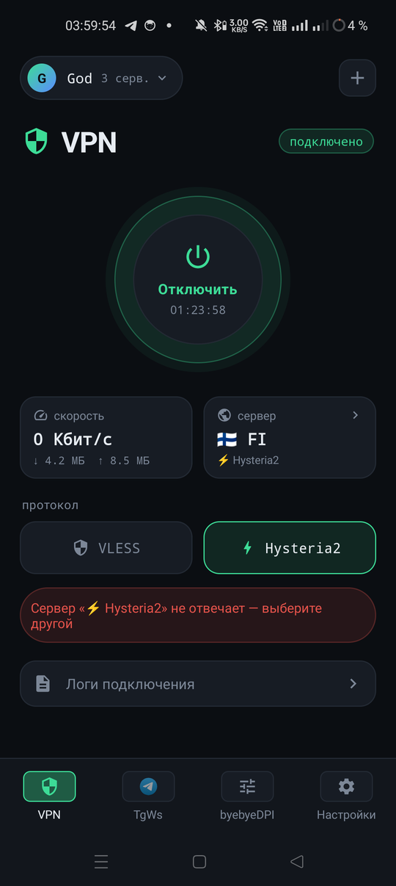

Главный экран. Сверху — профиль и число серверов в нём, по центру — кнопка
подключения со счётчиком времени, ниже скорость и текущий сервер со страной.

Строка **протокол** переключает способ связи с сервером. Если не знаете, какой
выбрать, оставьте тот, что уже выбран: приложение подставляет рабочий.

Красная полоса на снимке — предупреждение, что сервер перестал отвечать.
Приложение проверяет его каждые полминуты и само сообщает о проблеме.

Кнопка **Логи подключения** внизу открывает журнал — он нужен, только если
что-то не работает и надо показать кому-то, почему.

 

### Добавить профиль

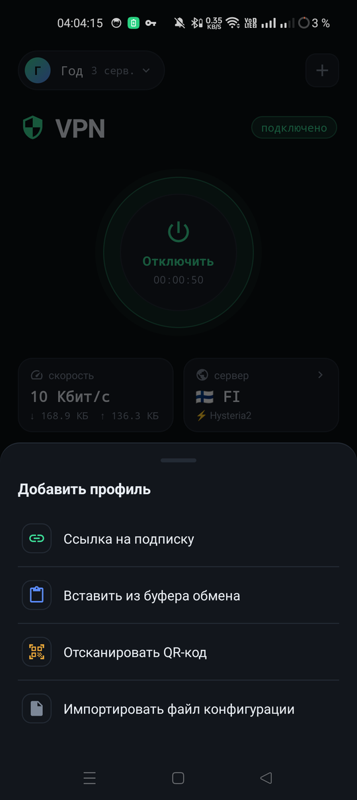

VPN нужен сервер. Нажмите **+** в правом верхнем углу — снизу выедет окно
с четырьмя способами:

- **Ссылка на подписку** — адрес, который дал продавец VPN. Нужен только адрес,
  ни логина, ни пароля вводить не надо.
- **Вставить из буфера обмена** — если ссылка уже скопирована.
- **Отсканировать QR-код** — наведите камеру на код с сайта продавца.
- **Импортировать файл конфигурации** — файл в формате YAML или TXT.

Подписка обновляется сама: если продавец поменял серверы, приложение подтянет
новые при следующем подключении.

 

### Если пишет «Сервер не отвечает»

1. Откройте карточку **сервер** и выберите другой из списка.
2. Не помогло — смените протокол.
3. Не помогло и это — проблема на стороне продавца VPN либо ваша сеть режет
   этот протокол. Чаще всего так бывает с Hysteria2 на мобильном интернете:
   он работает по UDP, а его иногда блокируют.

---

## TgWs — Telegram через WebSocket

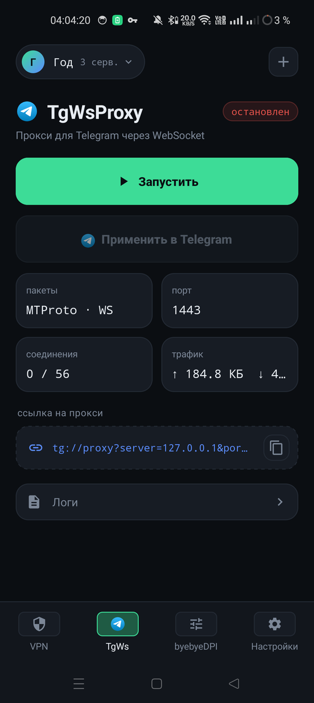

Отдельный режим только для Telegram. Это не VPN: остальные приложения его не
замечают, интернет не замедляется, батарея почти не расходуется.

1. Нажмите **Запустить**.
2. Нажмите **Применить в Telegram** — Telegram откроется сам и предложит
   включить прокси.

Всё. На экране видно порт, число соединений и трафик. Ссылку на прокси можно
скопировать кнопкой справа, если хотите настроить Telegram вручную или на
другом устройстве.

Проверять надо именно загрузку сообщений и картинок: если картинки грузятся —
работает.

 

---

## byebyeDPI — обход блокировок без VPN

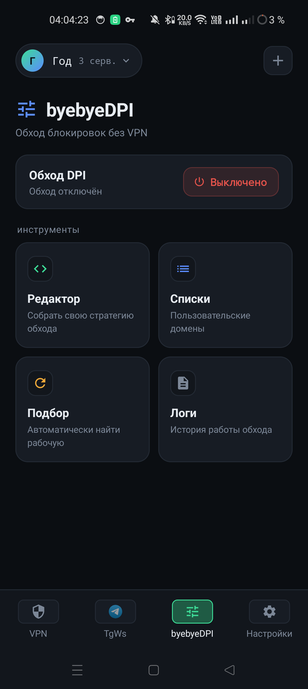

Работает без сервера: приложение так меняет вид запросов, что фильтр
провайдера не узнаёт заблокированный адрес. Бесплатно и быстро, но помогает
не везде.

Кнопка сверху включает обход. Ниже четыре инструмента:

| Инструмент | Зачем |
|---|---|
| **Редактор** | Собрать свою стратегию обхода |
| **Списки** | Домены, на которых проверяются стратегии |
| **Подбор** | Перебрать стратегии и найти рабочую |
| **Логи** | История работы обхода |

Начинать надо с **Подбора** — он сделает всё сам.

 

### Подбор

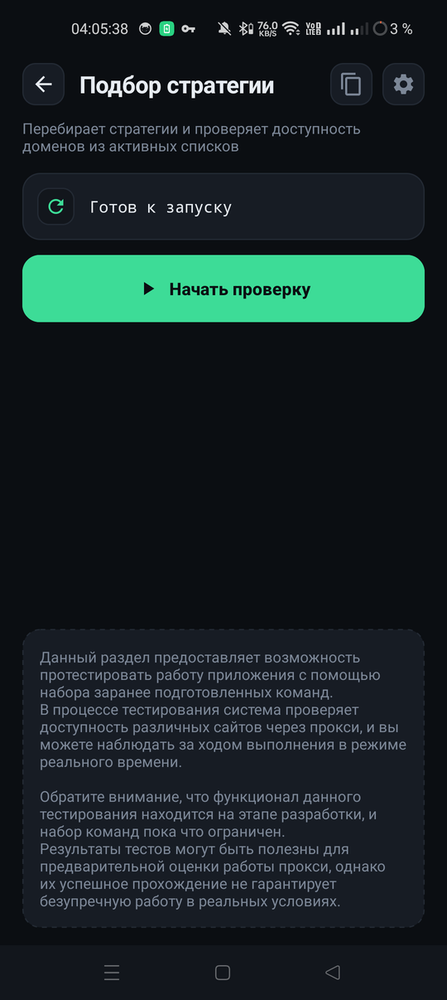

Нажмите **Начать проверку**. Приложение переберёт заготовленные стратегии и
проверит на них доступность сайтов из ваших списков, показывая ход работы.

Результат — список того, что сработало. Рабочую стратегию можно применить
одним нажатием, и дальше обход будет работать с ней.

Успешная проверка не гарантирует, что всё будет идеально в реальной жизни:
провайдеры меняют фильтры, и иногда подбор приходится повторять.

 

### Списки доменов

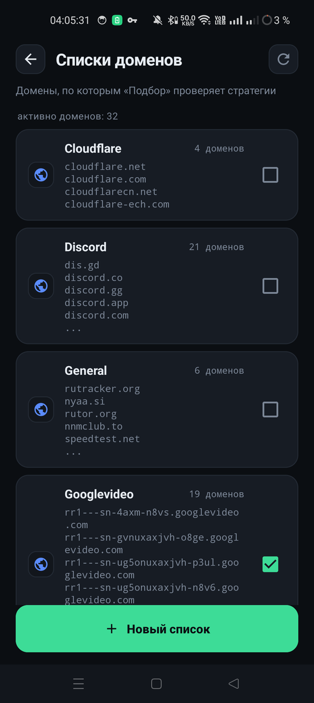

Здесь указано, на каких сайтах **Подбор** проверяет стратегии. Галочка справа
включает список целиком, сверху видно, сколько доменов активно.

Готовые списки уже собраны: Cloudflare, Discord, Googlevideo и общий. Кнопка
**Новый список** внизу добавляет свой — например, если у вас не открывается
конкретный сайт, добавьте его отдельным списком и запустите подбор.

 

### Редактор стратегии

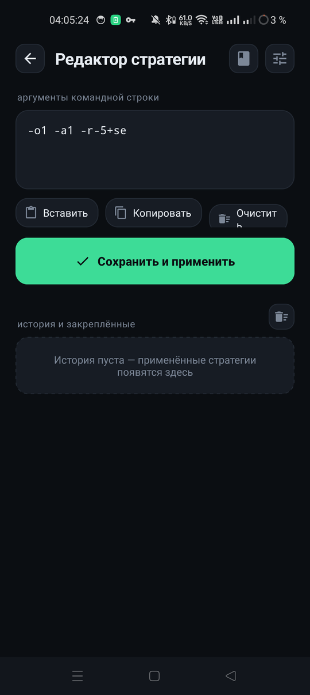

Нужен, только если подбор ничего не нашёл. Стратегия — это набор параметров
командной строки вроде `-o1 -a1 -r-5+se`, каждый из которых по-своему меняет
вид запроса.

Кнопки **Вставить** и **Копировать** переносят стратегию между приложениями:
удобно, если нашли рабочую строку в чате или на форуме.

Всё, что вы применяли, сохраняется в истории внизу — понравившееся можно
закрепить и возвращаться к нему.

 

### Настройки byebyeDPI

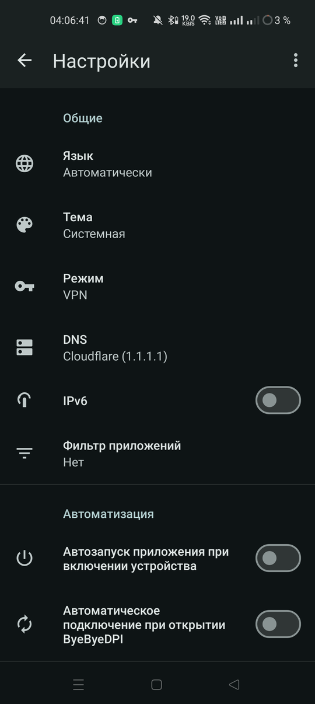

**Режим** — главная настройка:

- **VPN** — обход работает во всех приложениях, но занимает единственный слот
  VPN, то есть с нашим VPN одновременно не включится.
- **Proxy** — приложение поднимает локальный прокси, в который надо направить
  браузер вручную. Зато не мешает настоящему VPN.

**DNS** — какой сервер имён использовать. Трогать не нужно, кроме одного случая.

> **Частный DNS ломает обход.** Если в настройках Android включён Частный DNS
> (Сеть → Частный DNS), телефон шлёт запросы имён мимо приложения, и обход
> перестаёт работать. Приложение это замечает: вместо выбора DNS появится
> строка «Частный DNS» с именем сервера, а нажатие на неё ведёт прямо в
> системные настройки, где его можно выключить.

Внизу — автозапуск при включении телефона и автоподключение при открытии.

 

---

## Логи

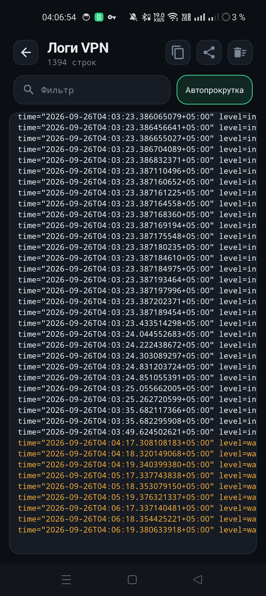

У каждого раздела свой журнал: у VPN, у TgWs и у обхода DPI. Сверху — поиск по
строкам и автопрокрутка, справа кнопки скопировать, поделиться и очистить.

Читать их обычно не нужно. Но если что-то не работает и вы просите помощи —
кнопка «поделиться» отправит журнал целиком, и по нему сразу видно причину.

 

---

## Настройки и обновления

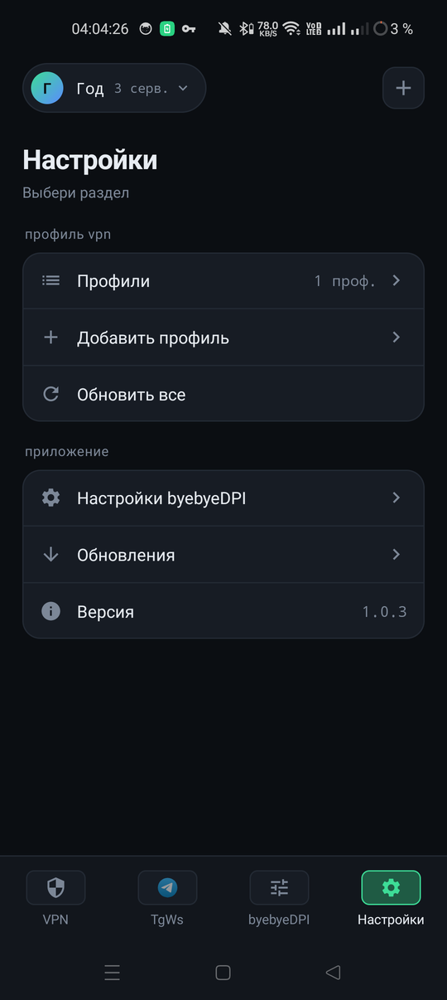

Раздел **Настройки** собирает всё вместе: профили VPN, кнопку обновить все
подписки сразу, настройки byebyeDPI и обновления приложения.

 

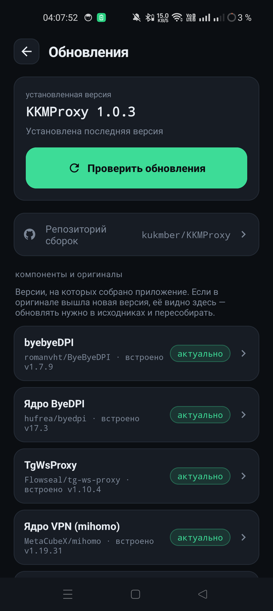

Приложение раз в сутки само проверяет, не вышла ли новая версия, и предлагает
скачать. Здесь же можно проверить вручную.

Ниже видно, из чего приложение собрано: ядро обхода DPI, ядро VPN, порт
TgWsProxy. Пометка **актуально** означает, что версия совпадает с оригиналом.
Если у какого-то компонента выйдет новая — она приедет вместе со следующей
версией приложения, отдельно ничего качать не надо.

 

---

## Иконка меняется сама

С 1 декабря по 31 января на иконке новогодний огурец, 12 октября — груша,
в остальное время обычный. Настраивать ничего не нужно.

---

## Если что-то не работает

| Что происходит | Что делать |
|---|---|
| VPN подключился, но интернета нет | Сменить сервер, затем протокол |
| «Нет разрешения на активацию VPN» | Нажать «Подключить» снова и согласиться в системном окне |
| Обход DPI не помогает | Проверить Частный DNS, запустить Подбор |
| VPN и обход DPI не включаются вместе | Так и задумано: Android даёт одно VPN. Переведите обход в режим Proxy |
| Telegram не работает при включённом VPN | Отключить прокси в самом Telegram — через VPN он и так работает |
| Приложение не ставится | Скачать `universal` вместо `arm64-v8a` |
| Play Protect ругается | Приложение не из Google Play, подпись ему незнакома — «Установить всё равно» |
| Уведомление висит, хотя всё выключено | Смахнуть уведомление; если осталось — перезапустить приложение |
